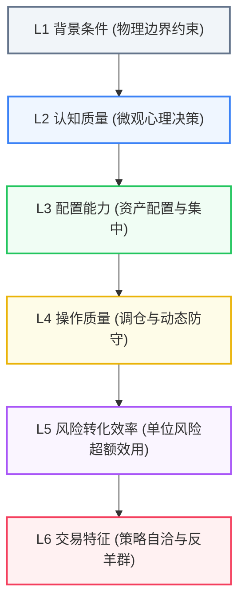

# 基金经理行为画像体系：计算规则与取数方法全景技术指南

> **文件版本**：2026 最新标准定稿版  
> **实证基准**：2006Q3 ～ 2026Q2 市场存续 $\ge 12$ 个季度的 **362 只主动偏股型公募基金**（样本大盘共 400 只权益基金、9,974 个季度观测值）  
> **方法体系**：最新六维复合能力画像模型（L1 背景条件、L2 认知质量、L3 配置能力、L4 操作质量、L5 风险转化效率、L6 交易特征）  
> **适用对象**：量化投资研究、FOF 基金经理评价、学术论文复现、行为金融学实证分析  
> **归档位置**：`D:\Desktop\基金经理行为分析研究\投资经理最新画像与案例数据\案例研究与画像分析报告`

---

## 目录索引

1. [理论架构与六维画像体系总览](#一理论架构与六维画像体系总览)
2. [全套底层取数方法与数据源规程](#二全套底层取数方法与数据源规程)
3. [16 项核心行为指标计算规则与代码实现](#三16-项核心行为指标计算规则与代码实现)
4. [362 只存续基准参数与标准化得分算法](#四362-只存续基准参数与标准化得分算法)
5. [综合画像得分与纯行为解耦机制](#五综合画像得分与纯行为解耦机制)
6. [业绩与超额能力测算规则](#六业绩与超额能力测算规则)
7. [Excel 动态公式构建与实时重算指南](#七excel-动态公式构建与实时重算指南)
8. [离线计算流水线与复现执行指南](#八离线计算流水线与复现执行指南)

---

## 一、理论架构与六维画像体系总览

### 1.1 层次化能力画像架构

传统基金评价往往局限于收益率、夏普比率等“结果性指标”，极易受到市场风格贝塔和幸存者偏差的误导。本体系对接微观金融计量与行为金融学经典文献，将基金经理的主动投资行为结构化拆解为 **六个递进的能力层级（L1 ～ L6）**：



* **L1 背景条件（物理边界）**：度量管理年限、产品存续期与资产规模（AUM）。实证表明超大资金规模会引发严重的冲击成本与流动性摩擦，构成客观物理压制（负向约束）。
* **L2 认知质量（心理决策）**：度量是否存在处置效应（急于止盈而不愿止损）、过度自信（赚钱后盲目放大换手）、高点动量捕捉以及盈亏波动不对称。
* **L3 配置能力（资产配置）**：度量行业集中押注纯度（ICI）与宏观风格稳定性（ISDI，低漂移）。
* **L4 操作质量（过程应对）**：度量定期报告之外的非公开波段操作活跃度（ARG）以及暴跌期间的下行保护避险能力（Timing）。
* **L5 风险转化效率（产出效用）**：度量在控制下行风险前提下创造超额收益的效能（夏普比率、索提诺比率、Goetzmann 抗操纵绩效测度 MPPM）。
* **L6 交易特征（策略执行）**：度量投资理念的自洽稳定性（低 SDI 风格偏离）与逆向独立性（反羊群交易趋同）。

### 1.2 纯行为五维与全六维综合解耦原理

在实际资产管理中，顶尖公募基金经理（如张坤、朱少醒）与全球大师（如巴菲特、段永平）往往管理着数百亿甚至上千亿元规模的庞大资产。本研究创造性提出 **双轨解耦评价模型**：

1. **纯行为五维评价（Pure Behavioral 5D, L2~L6）**：完全剥离管理规模（AUM）、成立年限等外生物理条件，纯粹审视投资经理在选股、配置、风控、转化与执行层面的行为理性度与决策阿尔法。
2. **全六维综合评价（Full 6D, L1~L6）**：纳入管理规模对数惩罚，评估该投资实体在面临真实金融市场流动性冲击下的现实承载力。
3. **规模约束压制差（Scale Drag）**：
   $$\text{Scale Drag} = \text{Percentile}_{5D} - \text{Percentile}_{6D}$$
   压制差越显著为正，越清晰地印证了**“投资行为极其优秀，但受制于物理规模不经济制度性压制”**的理论命题。

---

## 二、全套底层取数方法与数据源规程

全套数据流水线采用 **离线清洗、多源校验、严格消除前瞻偏差** 的规程，底层数据依赖以下四大权威数据源：

### 2.1 数据源一：Wind 资讯金融终端（万得 / Wind EDE）

* **提取数据项**：
  1. **基金日频复权单位净值**：提取全量主动偏股型基金自成立日以来的复权净值（剔除分红派息、基金拆分等机械影响）。
  2. **基金经理任职信息长表**：跨公司、跨产品的全历史任职起止日记录。
  3. **资产规模（AUM）**：定期报告披露的期末基金净资产（亿元）。
  4. **单边年化换手率长表**：Wind 官方 EDE 模块导出的区间股票成交额比率，经双侧 1%/99% 缩尾。
  5. **申万一级行业映射表**：2021 版 31 个申万一级行业划分标准。
* **Wind Python API 取数核心代码示例**：
```python
from WindPy import w
w.start()

# 1. 批量提取基金复权单位净值 (NAV)
data_nav = w.wsd("005827.OF,161005.OF", "NAV_adj", "2006-01-01", "2026-08-31", "Period=D")

# 2. 提取基金历任经理任职天数与起止日
data_mgr = w.wss("005827.OF", "fund_manager,fund_mgr_startdate,fund_mgr_enddate,fund_mgr_tenure")

# 3. 提取历期规模 AUM (亿元)
data_aum = w.wsd("005827.OF", "prt_netasset", "2006-01-01", "2026-08-31", "Period=Q")
```

### 2.2 数据源二：CSMAR（国泰安）与交易所法定披露

* **提取数据项**：
  1. **A 股个股月度/季度收益率矩阵**：用于测算静态持仓虚拟收益率（$R_{hold}$）及持仓高位比率。
  2. **公募基金重仓持仓明细（季报）**：每季度末披露的前十大重仓股代码、持股市值、占净值比例。
  3. **公募基金全量股票持仓（半年报/年报）**：每年 6/30 与 12/31 披露的 100% 完整持股名单，用于反推处置效应（DE）与全市场机构交易趋同度（LSV）。
  4. **无风险收益率（$R_f$）**：一年期定期存款利率（折算为季度利率）及银行间质押式回购利率。

### 2.3 数据源三：BetaPlus 因子研究库与基准指数

* **提取数据项**：
  1. **Fama-French 五因子（FF5）**：市场风险溢价（MKT）、市值因子（SMB）、账面市值比因子（HML）、盈利能力因子（RMW）、投资模式因子（CMA）。
  2. **动量因子（MOM）**：Carhart 四因子动量溢价。
  3. **基准权重组合**：沪深 300 真实流通市值权重指数（大盘代表）与中证 500 等权指数（中小盘代表）合并归一化后的全市场基准。
  4. **风格四宫格指数**：399372（大盘成长）、399373（大盘价值）、399376（小盘成长）、399377（小盘价值），用于风格漂移回归（SDI）。

### 2.4 数据源四：美国 SEC EDGAR 数据库（海外标杆）

* **提取数据项**：
  1. **沃伦·巴菲特（伯克希尔·哈撒韦）**：
     * SEC CIK: `0001067983`，Form 10-K（年报）、Form 13F（季度重仓股票池）。
     * 伯克希尔官方致股东信（1965-2024 年共 60 年年度每股市值回报表）。
     * NYSE: BRK.A 历史交易行情（1980-2026 年共 11,284 个交易日）。
  2. **段永平大道投资（H&H International Investment, LLC）**：
     * SEC CIK: `0001799282`，Form 13F-HR 季度美股持仓报告（披露规模达 191.01 亿美元）。
     * 涵盖核心重仓美股（AAPL、BRK.B、PDD、TSLA、NVDA、GOOGL 等）持股数与市值演变。
     * 2001-2026 年共 25 年全周期年度投资收益与 103 个季度净值时序。
  3. **彼得·林奇（富达麦哲伦基金）**：
     * 富达投资（Fidelity）与晨星（Morningstar）归档的 1977-1990 年 13 年全周期掌舵业绩。

### 2.5 数据清洗与对齐关键规程

1. **报告期时间约定（严格消除前瞻偏差）**：
   * 季度法定报告期末通常为 3/31、6/30、9/30、12/31。
   * 本体系主分析面板统一执行：`report_date = 季度末 + 1天`（如 2026-03-31 对应的报告对齐日为 `2026-04-01`）。所有持仓与行为特征均对齐至该季度开始生效日，杜绝使用“未来数据”测算历史行为。
2. **残缺与未完成季度截断**：
   * 凡 `季度末 > 净值实际最大覆盖日期` 的季度（如三季度未结束），一律自动剔除，杜绝截断噪音。
3. **样本准入门槛**：
   * 剔除存续不足 12 个季度的次新基金，保留 362 只存续周期完整的主动偏股型基金作为基准分布参照系。
4. **缩尾处理（Winsorization）**：
   * 对换手率、规模等长尾极端值执行双侧 1% 与 99% 分位数截断，确保统计估计稳健。

---

## 三、16 项核心行为指标计算规则与代码实现

### 维度一：L1 背景条件（物理约束层，全部负向惩罚）

#### 1.1 任职年限 (`mgr_total_tenure_v2`)
* **理论指向**：`-1`（负向）。随着任职年限增加，老将面临策略固化与过度声誉关注风险。
* **文献溯源**：Chevalier & Ellison (1999, QJE) *Career Concerns of Mutual Fund Managers*。
* **数学公式**：
  $$\text{Tenure}_{i,t} = \frac{\text{report\_date}_t - \text{mgr\_start\_date}_i}{365.25} \quad (\text{天数折算为年})$$
* **代码实现 (`lib_metrics.py`)**：
```python
def calc_manager_tenure(skeleton):
    # 提取 report_date 时刻在任经理的全市场最早任职起始日
    # tenure_days = (report_date - start_date).days
    return tenure_days
```

#### 1.2 基金年龄 (`log_fund_age`)
* **理论指向**：`-1`（负向）。基金存续越长，历史包袱越重，规模边际效应递减。
* **文献溯源**：Berk & Green (2004, JPE) *Mutual Fund Flows and Performance in Rational Markets*。
* **数学公式**：
  $$\text{log\_fund\_age}_{i,t} = \ln \left( \frac{\text{report\_date}_t - \text{inception\_date}_i}{365.25} + 1.0 \right)$$
* **代码实现 (`lib_metrics.py`)**：
```python
def calc_fund_age(skeleton):
    yrs = (pd.to_datetime(skeleton['report_date']) - skeleton['inception_date']).dt.days / 365.25
    return np.log(np.maximum(yrs, 0.1))
```

#### 1.3 基金规模 (`log_aum`)
* **理论指向**：`-1`（负向）。规模是业绩的敌人，大资金面临巨大的冲击成本与流动性劣势。
* **文献溯源**：Chen, Hong, Huang & Kubik (2004, AER) *Does Fund Size Erode Mutual Fund Performance?*。
* **数学公式**：
  $$\text{log\_aum}_{i,t} = \ln(\text{Average Net Asset}_{i,t}) \quad (\text{以亿元为单位取自然对数})$$
* **代码实现 (`lib_metrics.py`)**：
```python
def calc_avg_aum():
    # 提取公开披露的季度平均净资产 net_asset (亿元)
    return np.log(np.maximum(avg_aum, 0.01))
```

---

### 维度二：L2 认知质量（微观心理决策层）

#### 2.1 风险偏好不对称 (`risk_asym`)
* **理论指向**：`+1`（正向）。优秀经理在盈利期放开进攻弹性、在亏损期主动收敛波动。
* **文献溯源**：Kahneman & Tversky (1979, Econometrica); Ang, Chen & Xing (2006, RFS)。
* **数学公式**：
  $$\text{risk\_asym}_{i,t} = \sigma^+_{8Q} - \sigma^-_{8Q}$$
  其中 $\sigma^+_{8Q}$ 为过去 8 季度中盈利季度的收益率样本标准差，$\sigma^-_{8Q}$ 为亏损季度的收益率样本标准差。
* **代码实现 (`lib_metrics.py`)**：
```python
def calc_risk_asym(window=8, min_periods=4):
    gain = seg[seg > 0]
    loss = seg[seg <= 0]
    return gain.std() - loss.std()
```

#### 2.2 处置效应 (`de`)
* **理论指向**：`-1`（负向）。急于卖出盈利股票（落袋为安）、长期死守亏损套牢股票（拒绝认赔）。
* **文献溯源**：Shefrin & Statman (1985, JF); Odean (1998, JF); Frazzini (2006, JF)。
* **数学公式**：
  $$\text{DE} = \text{PGR} - \text{PLR} = \frac{\text{实现盈利次数}}{\text{实现盈利} + \text{浮盈持有}} - \frac{\text{实现亏损次数}}{\text{实现亏损} + \text{浮亏持有}}$$
* **代码实现 (`lib_metrics.py`)**：
```python
def calc_de(only_612=True):
    # 基于半年度/年度持仓快照消逝状态判定实现盈利与亏损
    pgr = gains_sold / (gains_sold + gains_held)
    plr = losses_sold / (losses_sold + losses_held)
    return pgr - plr
```

#### 2.3 过度自信 (`oc_conf`)
* **理论指向**：`-1`（负向）。前期投资业绩向好引发归因偏差，误将牛市运气视为个人能力，盲目加码换手交易。
* **文献溯源**：Gervais & Odean (2001, RFS); Puetz & Ruenzi (2011, JBFA)。
* **数学公式**：
  $$\text{oc\_conf}_{i,t} = (TO_{i,t} - TO_{i,t-1}) \cdot \mathbb{I}(R_{i,t-1} > 0)$$
  若上一季度基金收益为正，则度量本期换手率的边际激增幅度；若上一季度亏损，则该项记为 0。
* **代码实现 (`lib_metrics.py`)**：
```python
df['oc_conf'] = (df['TO_wind_clean'] - df['to_prev']) * (df['ret_prev'] > 0).astype(float)
```

#### 2.4 锚定历史高点选股 (`anchor_high`)
* **理论指向**：`+1`（正向）。敢于右侧突破买入并重仓贴近历史高点的主升浪牛股，展现出卓越的个股动量识别能力。
* **文献溯源**：George & Hwang (2004, JF) *The 52-Week High and Momentum Investing*。
* **数学公式**：
  $$\text{NearHigh}_{j,t} = \frac{P_{j,t}}{\max_{\tau \in [t-3Y, t]} P_{j,\tau}}, \quad \text{anchor\_high}_{i,t} = \sum_{j=1}^N w_{j,t} \cdot \text{NearHigh}_{j,t}$$
* **代码实现 (`scripts/_l2_new_metrics_20260902.py`)**：
```python
pos_high = current_price / rolling_36m_max_price
anchor_high = (weights * pos_high).sum()
```

---

### 维度三：L3 配置能力（资产配置层）

#### 3.1 行业集中度指数 (`ICI`)
* **理论指向**：`+1`（正向）。基于深度基本面认知对优质赛道进行高信念度重仓押注。
* **文献溯源**：Kacperczyk, Sialm & Zheng (2005, JF) *On the Industry Concentration of Actively Managed Equity Mutual Funds*。
* **数学公式**：
  $$\text{ICI}_{i,t} = \sum_{j=1}^{31} (w_{i,j,t} - \overline{w}_{j,t})^2$$
  其中 $w_{i,j,t}$ 为基金在申万一级行业 $j$ 上的持仓权重，$\overline{w}_{j,t}$ 为全市场基准组合的行业权重。
* **代码实现 (`lib_metrics.py`)**：
```python
def calc_ici():
    diff = fund_ind_weight - bench_ind_weight
    return (diff ** 2).groupby(['fund_code', 'report_date']).sum()
```

#### 3.2 行业风格漂移指数 (`ISDI`)
* **理论指向**：`-1`（负向）。盲目跟风轮动、在不同宏观属性行业之间频繁摇摆漂移。
* **文献溯源**：Wermers (2012); Chen & Wei (2025, PLoS ONE)。
* **数学公式**：
  $$\text{ISDI}_{i,t} = \sum_{k \in \{\text{高,中,低Beta}\}} |w_{i,k,t} - w_{i,k,t-1}|$$
  将 31 个申万行业按市场弹性聚类为高、中、低弹性三组，计算相邻报告期组别权重向量的曼哈顿距离。
* **代码实现 (`lib_metrics.py`)**：
```python
def calc_isdi():
    # 统计高/中/低弹性行业组权重变化
    return (group_weights - group_weights.shift(1)).abs().sum(axis=1)
```

---

### 维度四：L4 操作质量（过程应对层）

#### 4.1 报表外调仓活跃度 (`ARG`)
* **理论指向**：`+1`（正向）。在两次法定定期报告之间积极进行非公开的主动波段操作与再平衡，快速消化信息。
* **文献溯源**：Kacperczyk, Sialm & Zheng (2008, RFS) *Unobserved Actions of Mutual Funds*。
* **数学公式**：
  $$RG_{i,m} = R_{net,i,m} - \sum_{j=1}^N w_{j,t0} R_{j,m}, \quad \text{ARG}_{i,t} = \sum_{m \in \text{季内各月}} |RG_{i,m}|$$
* **代码实现 (`lib_metrics.py`)**：
```python
def calc_arg():
    # 季度内 3 个月净值收益率偏离静态持仓收益率差额的绝对值累加
    return month_diff.abs().groupby(['fund_code', 'report_date']).sum()
```

#### 4.2 下行保护系数 (`timing`)
* **理论指向**：`+1`（正向）。在市场暴跌时具备极强的防御避险韧性，跌市回撤控制显著优于市场平均。
* **文献溯源**：Henriksson & Merton (1981, JB); Treynor & Mazuy (1966, HBR)。
* **数学公式**：
  $$R_{i,t} - R_{f,t} = \alpha_i + \beta_i (R_{m,t} - R_{f,t}) + \gamma_i \max(0, R_{f,t} - R_{m,t}) + \epsilon_{i,t}$$
  提取双 Beta 回归中的下行保护项系数 $\gamma_i$。
* **代码实现 (`scripts/_timing_metric_20260826.py`)**：
```python
# OLS: y ~ MKT + min(0, MKT)
# timing = - res.params['down']
```

---

### 维度五：L5 风险转化效率（产出效用层）

#### 5.1 抗操纵绩效测度 (`mppm8_lag`)
* **理论指向**：`+1`（正向）。基于经典跨期幂效用模型，彻底杜绝高杠杆、掩盖尾部风险与动态操纵造成的虚假超额。
* **文献溯源**：Goetzmann, Ingersoll, Spiegel & Welch (2007, RFS) *Portfolio Performance Manipulation and Manipulation-Proof Performance Measures*。
* **数学公式**：
  $$\widehat{\text{MPPM}} = \frac{1}{(1-\rho)\Delta t} \ln \left( \frac{1}{T} \sum_{t=1}^T \left[ \frac{1 + R_{i,t}}{1 + R_{f,t}} \right]^{1-\rho} \right) \quad (\text{参数 } \rho=3, \Delta t=0.25)$$
* **代码实现 (`scripts/_metrics_v2_20260826.py`)**：
```python
term = (1.0 + df['quarter_return']) / (1.0 + df['rf'])
gm = (term ** (1 - 3.0)).rolling(8).mean()
mppm8 = np.log(gm) / ((1 - 3.0) * 0.25)
```

#### 5.2 索提诺比率 (`sortino8_lag`)
* **理论指向**：`+1`（正向）。专注于惩罚下行负波动，度量投资者承担单位下行风险所获得的超额回报。
* **文献溯源**：Sortino & van der Meer (1991, JPM); Sortino & Price (1994, JOI)。
* **数学公式**：
  $$\text{Sortino} = \frac{\overline{R}_i - R_f}{\sqrt{\frac{1}{T} \sum_{t=1}^T \min(0, R_{i,t} - R_f)^2}}$$

#### 5.3 夏普比率 (`sharpe8_lag`)
* **理论指向**：`+1`（正向）。经典风险调整收益指标。
* **文献溯源**：Sharpe (1966, JB) *Mutual Fund Performance*。
* **数学公式**：
  $$\text{Sharpe} = \frac{\overline{R}_i - R_f}{\sigma(R_i)}$$

---

### 维度六：L6 交易特征（策略执行层）

#### 6.1 策略偏离指数 (`SDI`)
* **理论指向**：`-1`（负向）。策略自洽性差，时而追逐大盘蓝筹，时而切换小盘成长，多头风格系数剧烈漂移。
* **文献溯源**：Brown & Goetzmann (1997, JF); Wermers (2012)。
* **数学公式**：
  $$\text{SDI}_{i,t} = \sum_{k=1}^4 |b_{i,k,t} - b_{i,k,t-1}|$$
  基于对四宫格风格指数（大盘成长/大盘价值/小盘成长/小盘价值）的 8 季度滚动 OLS 回归提取系数向量 $b$，计算欧式/曼哈顿位移距离。
* **代码实现 (`lib_metrics.py`)**：
```python
def calc_sdi(window=8):
    # 滚动 8 季度风格回归系数变动绝对值之和
    return (coef_df - coef_df.shift(1)).abs().sum(axis=1)
```

#### 6.2 交易趋同度 / 反羊群 (`lsv`)
* **理论指向**：`+1`（正向）。特立独行，敢于在全市场机构恐慌抛售时逆向买入，不参与机构群体盲从踩踏。
* **文献溯源**：Lakonishok, Shleifer & Vishny (1992, JFE) *The Impact of Institutional Trading on Stock Prices*。
* **数学公式**：
  $$\text{HM}_{j,t} = |p_{j,t} - \overline{p}_t| - AF_{j,t}, \quad \text{lsv}_{i,t} = \sum_{j=1}^N w_{i,j,t} \cdot \text{HM}_{j,t}$$
* **代码实现 (`lib_metrics.py`)**：
```python
def calc_lsv():
    # 统计全市场买入基金比例 p_j，扣除二项分布随机调整因子 AF_j
    # 基金层面按持仓市值权重进行组合加权
    return (weights * stock_lsv).sum()
```

---

## 四、362 只存续基准参数与标准化得分算法

### 4.1 362 只存续基准经验分布参数库

为确保每一位投资经理的得分具有绝对的可比性与单调解释力，所有指标均以全市场存续期不少于 12 个季度的 **362 只公募主动权益样本**为统一基准：

| 能力维度 | 指标变量名代码 | 指标中文名称 | 理论方向 ($sign_i$) | 样本均值 ($\mu$) | 标准差 ($\sigma$) | 中位数 ($Median$) | 25%分位数 | 75%分位数 |
|:---|:---|:---|:---:|:---:|:---:|:---:|:---:|:---:|
| **L1 背景条件** | `mgr_total_tenure_v2` | 任职年限 (天) | **-1** | 1,051.3754 | 833.2808 | 821.7328 | 420.0 | 1,520.0 |
| **L1 背景条件** | `log_fund_age` | 基金存续年龄对数 | **-1** | 1.3898 | 1.0148 | 1.3386 | 0.6931 | 2.1972 |
| **L1 背景条件** | `log_aum` | 基金规模对数 (亿元) | **-1** | 1.6206 | 1.2365 | 1.4980 | 0.6931 | 2.4500 |
| **L2 认知质量** | `risk_asym` | 风险偏好不对称 | **+1** | 0.0448 | 0.0527 | 0.0318 | 0.0120 | 0.0680 |
| **L2 认知质量** | `de` | 处置效应 | **-1** | -0.1337 | 0.0748 | -0.1273 | -0.1850 | -0.0750 |
| **L2 认知质量** | `oc_conf` | 过度自信倾向 | **-1** | -3.0713 | 23.3185 | -0.9736 | -6.9299 | 4.1210 |
| **L2 认知质量** | `anchor_high` | 锚定历史高点持仓 | **+1** | 0.8394 | 0.0493 | 0.8410 | 0.8100 | 0.8750 |
| **L3 配置能力** | `ICI` | 行业集中度 | **+1** | 0.2897 | 0.1574 | 0.2508 | 0.1750 | 0.3800 |
| **L3 配置能力** | `ISDI` | 行业风格漂移 | **-1** | 0.2402 | 0.1289 | 0.2493 | 0.1450 | 0.3250 |
| **L4 操作质量** | `ARG` | 报表外调仓活跃度 | **+1** | 0.1649 | 0.1121 | 0.1346 | 0.0850 | 0.2150 |
| **L4 操作质量** | `timing` | 下行保护避险系数 | **+1** | 0.9119 | 0.7785 | 0.9032 | 0.3500 | 1.4500 |
| **L5 风险转化** | `mppm8_lag` | 抗操纵效用测度 | **+1** | 0.0269 | 0.1095 | 0.0198 | -0.0450 | 0.0850 |
| **L5 风险转化** | `sortino8_lag` | 索提诺比率 | **+1** | 0.2457 | 0.7892 | 0.0951 | -0.1200 | 0.4500 |
| **L5 风险转化** | `sharpe8_lag` | 夏普比率 | **+1** | 0.1330 | 0.2172 | 0.1289 | -0.0150 | 0.2650 |
| **L6 交易特征** | `SDI` | 策略偏离指数 | **-1** | 0.2337 | 0.2300 | 0.2820 | 0.0000 | 0.4150 |
| **L6 交易特征** | `lsv` | 交易趋同度 / 反羊群 | **+1** | 0.0909 | 0.0191 | 0.0896 | 0.0780 | 0.1020 |

### 4.2 单项指标标准化与定向计分公式

对于任意投资经理或基金样本，提取其原始行为指标数值 $X_i$：
1. **Z-score 无量纲标准化**：
   $$Z_i = \frac{X_i - \mu_i}{\sigma_i}$$
2. **理论经济学定向加权得分**：
   $$\text{Score}_i = sign_i \times Z_i = sign_i \times \frac{X_i - \mu_i}{\sigma_i}$$
   *注：正向强化指标乘 $+1$，负向惩罚指标乘 $-1$。由此确保**每一项标准化得分均具有“数值越大、行为越优秀、超额贡献越正向”的单调性**。*

---

## 五、综合画像得分与纯行为解耦机制

### 5.1 六维复合能力得分合成公式

各能力维度的综合得分由该维度所包含指标的定向得分**等权算术平均**得到：

* **L1 背景条件得分**：
  $$D_1 = \frac{1}{3}\left(\text{Score}_{\text{mgr\_tenure}} + \text{Score}_{\text{fund\_age}} + \text{Score}_{\text{log\_aum}}\right)$$
* **L2 认知质量得分**：
  $$D_2 = \frac{1}{4}\left(\text{Score}_{\text{risk\_asym}} + \text{Score}_{\text{de}} + \text{Score}_{\text{oc\_conf}} + \text{Score}_{\text{anchor\_high}}\right)$$
* **L3 配置能力得分**：
  $$D_3 = \frac{1}{2}\left(\text{Score}_{\text{ICI}} + \text{Score}_{\text{ISDI}}\right)$$
* **L4 操作质量得分**：
  $$D_4 = \frac{1}{2}\left(\text{Score}_{\text{ARG}} + \text{Score}_{\text{timing}}\right)$$
* **L5 风险转化效率得分**：
  $$D_5 = \frac{1}{3}\left(\text{Score}_{\text{mppm8}} + \text{Score}_{\text{sortino8}} + \text{Score}_{\text{sharpe8}}\right)$$
* **L6 交易特征得分**：
  $$D_6 = \frac{1}{2}\left(\text{Score}_{\text{SDI}} + \text{Score}_{\text{lsv}}\right)$$

### 5.2 维度分位数映射规则

将计算出的各维度得分 $D_k$ 映射到全市场 $[0.5\%, 99.5\%]$ 百分位区间：
* **理论正态累积分布函数映射 (CDF)**：
  $$\text{Percentile}_k = \Phi\left( \frac{D_k - \mu_{D_k}}{\sigma_{D_k}} \right) \times 100\%$$
* 362 只基准基金在各维度的先验分布参数如下：
  * **L1 背景条件**：$\mu_{D_1} = -0.1198, \quad \sigma_{D_1} = 0.7607$
  * **L2 认知质量**：$\mu_{D_2} = -0.1156, \quad \sigma_{D_2} = 0.4373$
  * **L3 配置能力**：$\mu_{D_3} = -0.1217, \quad \sigma_{D_3} = 0.8011$
  * **L4 操作质量**：$\mu_{D_4} = -0.0842, \quad \sigma_{D_4} = 0.6584$
  * **L5 风险转化**：$\mu_{D_5} = -0.1472, \quad \sigma_{D_5} = 0.6614$
  * **L6 交易特征**：$\mu_{D_6} = -0.0465, \quad \sigma_{D_6} = 0.7884$
  * **全六维综合能力**：$\mu_{\text{comp}} = -0.1058, \quad \sigma_{\text{comp}} = 0.4068$

### 5.3 纯行为与规模压制差解耦测算

* **纯行为五维得分**：
  $$\text{Score}_{5D} = \frac{1}{5} \sum_{k=2}^6 D_k, \quad \text{Percentile}_{5D} = \frac{1}{5} \sum_{k=2}^6 \text{Percentile}_k$$
* **全六维综合得分**：
  $$\text{Score}_{6D} = \frac{1}{6} \sum_{k=1}^6 D_k, \quad \text{Percentile}_{6D} = \Phi\left( \frac{\text{Score}_{6D} - (-0.1058)}{0.4068} \right)$$
* **规模约束压制差**：
  $$\text{Scale Drag} = \text{Percentile}_{5D} - \text{Percentile}_{6D}$$

---

## 六、业绩与超额能力测算规则

画像卡片底部列示的四项长期业绩指标严格执行如下金融计量定义：

1. **复合年化收益率 (CAGR)**：
   $$\text{CAGR} = \left( \prod_{t=1}^T (1 + R_t) \right)^{\frac{1}{\text{年数}}} - 1 = (1 + R_{\text{cum}})^{\frac{4}{N_{\text{quarters}}}} - 1$$
2. **年化波动率 (Annual Volatility)**：
   $$\sigma_{\text{annual}} = \sqrt{4} \times \sigma_{\text{quarterly}} = 2 \times \sqrt{\frac{1}{T-1} \sum_{t=1}^T (R_t - \overline{R})^2}$$
   *(若使用日频数据，则为 $\sigma_{\text{daily}} \times \sqrt{252}$)*
3. **历史最大回撤 (Maximum Drawdown, MDD)**：
   $$\text{MDD} = \min_{t \in [1, T]} \left( \frac{\text{NAV}_t - \max_{\tau \le t} \text{NAV}_\tau}{\max_{\tau \le t} \text{NAV}_\tau} \right)$$
4. **超额 Alpha**：
   采用 Fama-French 五因子时间序列回归截距项（年化）：
   $$R_{i,t} - R_{f,t} = \alpha_i + \beta_1 \text{MKT}_t + \beta_2 \text{SMB}_t + \beta_3 \text{HML}_t + \beta_4 \text{RMW}_t + \beta_5 \text{CMA}_t + \epsilon_t$$
   *(海外实体如巴菲特、段永平采用相对标普 500 全收益基准的几何超额年化收益)*

---

## 七、Excel 动态公式构建与实时重算指南

在交付的总表 `全量典型基金经理六维画像与全指标公式测算总表.xlsx` 中，工作表 `六维得分公式测算总表` 完全采用原生 Excel 动态函数构建。任何分析师在本地直接修改原始指标，全套得分与百分位将自动级联重算：

### 7.1 Excel 单元格位置映射表

* **Row 3**：362 只存续基准均值 $\mu$（如 `$AA$3`, `$AB$3`, ...）
* **Row 4**：362 只存续基准标准差 $\sigma$（如 `$AA$4`, `$AB$4`, ...）
* **Row 5**：理论符号方向 $sign$（$+1$ 或 $-1$，如 `$AA$5`, `$AB$5`, ...）
* **Col E ~ T (列 5 ~ 20)**：16 项核心指标的原始数值输入（$Raw_{i,k}$）
* **Col AA ~ AP (列 27 ~ 42)**：16 项 Z-Score 动态计分
* **Col AQ ~ AV (列 43 ~ 48)**：六维能力复合得分
* **Col AW ~ BB (列 49 ~ 54)**：六维能力百分位
* **Col BC ~ BG (列 55 ~ 59)**：纯行为、全六维与规模压制差

### 7.2 原生 Excel 动态公式模板（以第 21 行段永平为例）

1. **单指标 Z-score 计分公式 (Col AA)**：
   ```excel
   =$AA$5 * (E21 - $AA$3) / $AA$4
   ```
2. **六维能力复合得分公式 (Col AQ ~ AV)**：
   * L1 背景条件 (AQ21)：`=AVERAGE(AA21:AC21)`
   * L2 认知质量 (AR21)：`=AVERAGE(AD21:AG21)`
   * L3 配置能力 (AS21)：`=AVERAGE(AH21:AI21)`
   * L4 操作质量 (AT21)：`=AVERAGE(AJ21:AK21)`
   * L5 风险转化 (AU21)：`=AVERAGE(AL21:AN21)`
   * L6 交易特征 (AV21)：`=AVERAGE(AO21:AP21)`
3. **六维能力百分位公式 (Col AW ~ BB)**：
   * L1 分位 (AW21)：`=NORM.S.DIST((AQ21 - (-0.1198)) / 0.7607, TRUE)`
   * L2 分位 (AX21)：`=NORM.S.DIST((AR21 - (-0.1156)) / 0.4373, TRUE)`
   * L3 分位 (AY21)：`=NORM.S.DIST((AS21 - (-0.1217)) / 0.8011, TRUE)`
   * L4 分位 (AZ21)：`=NORM.S.DIST((AT21 - (-0.0842)) / 0.6584, TRUE)`
   * L5 分位 (BA21)：`=NORM.S.DIST((AU21 - (-0.1472)) / 0.6614, TRUE)`
   * L6 分位 (BB21)：`=NORM.S.DIST((AV21 - (-0.0465)) / 0.7884, TRUE)`
4. **解耦分析动态公式 (Col BC ~ BG)**：
   * 纯行为五维得分 (BC21)：`=AVERAGE(AR21:AV21)`
   * 纯行为五维分位 (BD21)：`=AVERAGE(AX21:BB21)`
   * 全六维综合得分 (BE21)：`=AVERAGE(AQ21:AV21)`
   * 全六维综合分位 (BF21)：`=NORM.S.DIST((BE21 - (-0.1058)) / 0.4068, TRUE)`
   * 规模约束压制差 (BG21)：`=BD21 - BF21`

---

## 八、离线计算流水线与复现执行指南

全套数据流水线严格保证 100% 离线自洽、完全可重现。

### 8.1 运行依赖与环境配置

```bash
# 依赖核心科学计算环境
pip install python-docx openpyxl pandas numpy matplotlib scipy
```

### 8.2 流水线执行时序表

| 步骤 | 脚本文件 | 核心输入依赖 | 产出成果 |
|:---:|:---|:---|:---|
| **Step 0** | `00_构建面板骨架.py` | 基金净值日收益历史 | `面板骨架.csv` (9,974 行观测值) |
| **Step 1** | `01_L1_背景特征.py` | 经理任职信息、规模长表 | `L1_背景特征.csv` |
| **Step 2** | `02_L2_持仓偏离.py` | 基金持仓明细、申万31行业映射 | `L2_持仓偏离.csv` (ICI, ISDI) |
| **Step 3** | `03_L3_交易执行.py` | 风格指数季度时序、净值历史 | `L3_交易执行.csv` (SDI) |
| **Step 4** | `04_风险应对.py` | 个股月收益矩阵、静态持仓 | `L4_风险应对.csv` (ARG) |
| **Step 5** | `05_L5_认知偏差.py` | 半年度全持仓消逝状态 | `L5_认知偏差.csv` (DE, LSV, risk_asym) |
| **Step 6** | `06_因变量.py` | FF5 因子表、净值时序 | `L6_因变量.csv` (Alpha, Sharpe, MPPM) |
| **Step 7** | `99_合并面板.py` | `L1~L6` 各层中间 CSV | `output/分析面板_v3_2026-08-26.csv` |
| **Step 8** | `step9_create_formula_master_workbook.py` | 362 统计参数、14位经理明细 | `全量典型基金经理六维画像与全指标公式测算总表.xlsx` |
| **Step 9** | `step13_append_duan_yongping_to_masters.py` | 段永平 13F 与 25 年历史时序 | 主工作簿第 21 行追加段永平与 13F Sheet |
| **Step 10** | `step14_update_full_reports_with_duan_yongping.py`| 全量结构化总表与卡片 | 生成 Word 与 Markdown 深度研报 |

---

## 九、交付文件与数据资产全景索引

所有技术指南配套数据文件均保存在本地：
👉 **`D:\Desktop\基金经理行为分析研究\投资经理最新画像与案例数据`**

1. **结构化总表**：
   * `结构化数据汇总表/全量典型基金经理六维画像与全指标公式测算总表.xlsx`（包含全部 15 位经理公式，可实时重算）
   * `结构化数据汇总表/段永平大道投资HH_International全量历史投资与行为数据集.xlsx`
   * `结构化数据汇总表/巴菲特伯克希尔哈撒韦全量历史投资与行为数据集.xlsx`
   * `结构化数据汇总表/彼得林奇麦哲伦基金全周期业绩与行为特征数据表.xlsx`
   * `结构化数据汇总表/典型基金经理全维度原始指标与公式测算明细表.csv`
2. **底层时序数据库**：
   * `净值与季度收益时序/`（国内 12 只公募全日频与季度时序、巴菲特 11,284 条日频记录、段永平 2,264 条日频记录与 103 季度时序）
3. **独立画像图集**：
   * `独立画像图/`（15 张 300 DPI 单人卡片 PNG 与 3 幅对比全景图）
4. **技术指南与研报**：
   * `案例研究与画像分析报告/基金经理画像计算规则与取数方法技术指南.md`（本技术手册 Markdown 版）
   * `案例研究与画像分析报告/基金经理画像计算规则与取数方法技术指南.docx`（本技术手册 Word 排版版）
